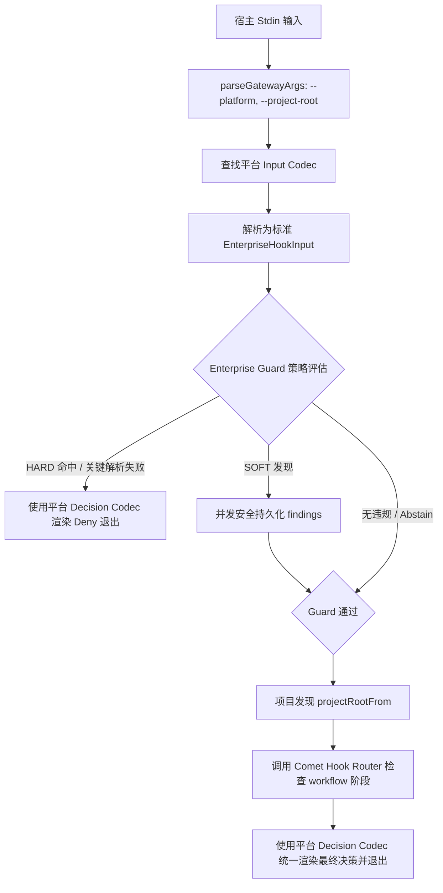
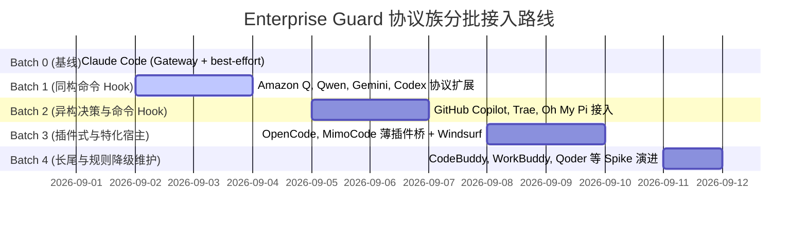

# Enterprise Guard 网关协议族扩展与分批接入设计

> 日期：2026-09-02
>
> 关联：[Issue #15](https://github.com/miniceM/comet/issues/15)、[Issue #1](https://github.com/miniceM/comet/issues/1)、[Issue #5](https://github.com/miniceM/comet/issues/5)
>
> 状态：设计提请审核
>
> 前序依赖：《Enterprise Guard 统一组合网关与多宿主本地硬阻断设计》（2026-09-01）

## 结论

在 2026-09-01 确立的“单一组合网关（Composite Gateway）+ 受管 Runner + 薄插件桥”架构基础上，针对 Issue #15 “扩展协议族并分批接入已验证平台”，核心设计结论如下：

1. **协议族分类学（Protocol Taxonomy）收敛**：不为 15+ 平台单独编写 15 套 Guard 逻辑，而是将宿主抽象为 **4 类输入协议族（Input Codec Families）** 与 **3 类决策协议族（Decision Codec Families）**，平台定义仅作为声明式的能力 Profile。
2. **单一 Gateway 统一接管命令 Hook 宿主**：所有支持命令 Hook 的平台（Claude、Codex、Amazon Q、Qwen、Gemini、GitHub Copilot、Trae 等）在安装时统一由单一受管 `comet-enterprise-gateway.mjs --platform <id>` 接管，替换原先的 `comet-hook-router.mjs` 和遗留 Enterprise Hook，实现“先 Guard 策略硬阻断，后 Router 阶段检查”的固定次序与原子渲染。
3. **分批落地与严格 Spike 门槛（Batched Rollout）**：
   - **Batch 1（同构/近同构命令 Hook 平台）**：`amazon-q`、`qwen`、`gemini`、`codex`。输入高度同构，阻断决策统一为 exit 2 / stderr，快速复用 codec 并实现 Gateway 接管。
   - **Batch 2（异构决策/二次解析命令 Hook 平台）**：`github-copilot`（字符串参数二次反序列化 + JSON stdout 阻断协议）、`trae` / `trae-cn`（配置分组与多环境）、`oh-my-pi`（TS Extension 桥接）。
   - **Batch 3（插件式 Hook 平台与特化平台）**：`opencode`、`mimocode`（薄插件桥 + 受管 Runner）、`windsurf`（`pre_write_code` 专用事件适配）。
   - **Batch 4（长尾/未核对平台）**：`codebuddy`、`workbuddy`、`qoder`、`grok` 等。在官方真实 Probe 证据完备前严格维持 `rules-and-ci` 降级，恪守“事实为本”原则。
4. **生命周期原子迁移与幂等维护**：`hook-lifecycle.ts` 解除对 `claude-code` 格式的单一绑定，通过平台 Profile 动态适配所有声明 `composite-gateway` 的平台；安装时自动清理旧 Router / 遗留 Enterprise Hook，卸载时精准移除 Comet 管理项，绝不触碰用户自定义 Hook。
5. **最小上游侵入与零破坏性**：所有新增 Codec、Profile 与生命周期扩展严格收敛在 `domains/enterprise-guard/` 内部，上游 `domains/comet-entry/` 的 Router 契约和各平台基础定义保持原样，通过公开接口被单向调用。

---

## 背景与问题陈述

在前期阶段（阶段 1 与阶段 2），Comet 已经完成了：
- 规范事件契约 `EnterpriseHookInput`（v1）与统一策略评估模型；
- Claude Code 平台的单一组合网关原型（`comet-enterprise-gateway.mjs`）验证与生命周期管理；
- Doctor 对 Claude 单一 Gateway 与其他平台 `rules-and-ci` 降级状态的透明报告。

然而，仓库中仍存在以下矛盾：
1. **多平台并存割裂**：目前除 Claude 外，其他平台在 `hook-lifecycle.ts` 中被直接 skip，仍单独安装 `comet-hook-router.mjs`，未能享受 Enterprise Guard 在工具执行前的本地 HARD 阻断保护。
2. **Codec 体系尚未扩展**：`domains/enterprise-guard/input-codecs/` 仅有 `claude.ts`，未针对 `qwen-style`、`gemini-style`、`copilot-style` 进行规范化拆分和复用。
3. **缺少清晰的分批落地和 Spike 验收路径**：14+ 平台的官方 Hook 规范各异，若无结构化分批策略，容易出现未验证平台虚标覆盖或一次性铺开带来的回归风险。

Issue #15 的核心职责就是完成**网关协议族扩展**与**分批接入方案设计**，建立从协议抽象、Profile 装配、生命周期迁移到 Spike 验收的完整体系。

---

## 协议族分类学与架构设计

### 1. 输入协议族（Input Codec Families）

通过对已支持平台的官方契约及现有 Comet 适配器进行归纳，输入协议收敛为 4 个核心族：

```text
原始输入 JSON / Stdin
  │
  ├─▶ [Standard / Claude-Style Codec] (claude, codex, amazon-q, grok)
  │     └─ 字段: cwd, tool_name, tool_input (object: file_path/content/command)
  │
  ├─▶ [Qwen-Style Codec] (qwen, qoder, codebuddy, workbuddy)
  │     └─ 字段: cwd, tool_name, tool_input, hook_event_name
  │
  ├─▶ [Gemini-Style Codec] (gemini)
  │     └─ 字段: cwd, tool_name, tool_input, mcp_context
  │
  └─▶ [Copilot-Style Codec] (github-copilot)
        └─ 字段: cwd, toolName, toolArgs (string JSON, 包含 filePath/patch/command)
```

每个 Input Codec 统一产出 `EnterpriseHookInput`（schema: `comet.enterprise-hook-input.v1`）：
- 强制包含安全截断追踪（`MAX_ENTERPRISE_HOOK_INPUT_BYTES = 256KB`）；
- 自动识别写操作（`create`, `edit`, `delete`, `rename`）与目标路径/片段；
- 自动识别命令操作（`command`）；
- 畸形 JSON 或截断输入标记 `parse.status = 'failed' | 'partial'`，确保策略引擎遵循“无法证明安全则拒绝”的 Fail-closed 原则。

### 2. 决策协议族（Decision Codec Families）

根据不同宿主对阻断、警告和上下文注入的协议要求，划分为 3 类决策协议：

| 决策协议 ID | 适用平台 | 放行语义 (Allow) | 阻断语义 (Deny) | 注入上下文 (Context) |
| :--- | :--- | :--- | :--- | :--- |
| `comet-command-hook` | Claude, Qwen, Gemini, Amazon Q, Codex, Trae | exit 0 (空输出) | exit 2 + stderr 拒绝理由 | exit 0 + stdout `hookSpecificOutput` JSON |
| `copilot-json` | GitHub Copilot | exit 0 (空或 `{}`) | exit 0 + stdout `{"permissionDecision": "deny", "permissionDecisionReason": "..."}` | exit 0 + stdout `{"additionalContext": "..."}` |
| `opencode-plugin-throw` | OpenCode, MimoCode | 函数正常 return | 抛出 Error(`reason`) 中止工具执行 | Runner 返回结构由插件桥消费 |

### 3. 平台 Profile 装配模型

在 `domains/enterprise-guard/platform-profiles.ts` 中，每个平台显式声明其 Profile 矩阵：

```ts
export interface EnterpriseGuardPlatformProfile {
  platformId: string;
  host: 'command-hook' | 'plugin-hook' | 'native-boundary' | 'none';
  inputCodec: 'claude' | 'qwen' | 'gemini' | 'copilot' | null;
  decisionCodec: 'comet-command-hook' | 'copilot-json' | 'opencode-plugin-throw' | null;
  installStrategy: 'composite-gateway' | 'managed-plugin' | 'not-installed';
  enforcement: 'managed' | 'project' | 'managed-plugin' | 'best-effort' | 'none';
  coveredTools: readonly string[];
  orderingGuarantee: 'final' | 'verified' | 'unknown';
}
```

---

## 单一组合网关编排与生命周期管理

### 1. Gateway 组合执行流

`comet-enterprise-gateway.mjs` 作为所有命令 Hook 平台的统一步骤：



### 2. 生命周期与受管 Hook 迁移（`hook-lifecycle.ts`）

- **支持判定**：由 `usesEnterpriseGuardGateway(platform)`（即 `profile.installStrategy === 'composite-gateway'`）统一判定，不再硬编码 `platform.hookFormat === 'claude-code'`。
- **Hook 命令配置生成**：针对每个支持 Gateway 的平台，生成对应的参数：
  ```ts
  function gatewayConfigForPlatform(platform: Platform): Record<string, HookConfig> {
    return {
      'comet/scripts/comet-enterprise-gateway.mjs': {
        matcher: platform.hookMatcher ?? 'Write|Edit|Bash',
        description: 'Enterprise Guard and Comet workflow enforcement',
        arguments: ['--platform', platform.id],
      },
    };
  }
  ```
- **原子迁移与遗留清理**：
  在安装 Gateway 时，除安装自身条目外，自动清理该平台旧有的 `comet-hook-router.mjs` 和 `comet-enterprise-hook.mjs`；如果遗留清理失败，则向用户报告可修复警告，避免出现双重 Hook 导致重复执行或顺序不可控。
- **卸载行为**：
  仅清理 Gateway 及其遗留 Enterprise Hook 条目，保留用户自定义的任何 Hook。

---

## 分批接入路线图与 Spike 验收标准

### 分批规划（Batched Rollout）



#### Batch 1：同构/近同构命令 Hook 平台（低风险、高收益）
- **目标平台**：`amazon-q`、`qwen`、`gemini`、`codex`。
- **协议特征**：
  - 输入：stdin 接收标准 JSON 对象，包含 `cwd`、`tool_name`、`tool_input` 等；
  - 决策：exit 2 + stderr 阻断，exit 0 放行；
  - 安装：支持标准的项目级或本地 Hook 配置文件（`.amazonq/settings.local.json`, `.qwen/settings.json`, `.gemini/settings.json`, `.codex/hooks.json`）。
- **实施要点**：
  - 实现 `qwen`、`gemini` 输入 codec；`amazon-q` 与 `codex` 直接复用 `claude` / 标准 codec。
  - 在 `platform-profiles.ts` 中将这 4 个平台的 `installStrategy` 提升为 `composite-gateway`。
  - 覆盖等级初始标为 `best-effort`（项目级 Gateway），与 Claude 一致，保留 CI 兜底。

#### Batch 2：异构决策/二次解析命令 Hook 平台
- **目标平台**：`github-copilot`、`trae`、`trae-cn`、`oh-my-pi`。
- **协议特征**：
  - `github-copilot`：`toolArgs` 是 JSON 字符串需要二次解析；阻断协议为 exit 0 + stdout JSON `{ permissionDecision: 'deny', ... }`。
  - `trae` / `trae-cn`：PreToolUse 组配置与多配置目录。
  - `oh-my-pi`：通过 TS Extension Bridge 转发请求给 Gateway。
- **实施要点**：
  - 实现 `copilot` 输入 codec 与 `copilot-json` 决策 codec。
  - 适配 Trae 的多配置目录与 OMP Bridge 的参数传递。

#### Batch 3：插件式 Hook 宿主与特化宿主
- **目标平台**：`opencode`、`mimocode`、`windsurf`。
- **协议特征**：
  - `opencode` / `mimocode`：没有官方命令 Hook，通过受管插件桥监听 `tool.execute.before` 事件，以 IPC / 进程调用受管 `comet-enterprise-runner.mjs`，通过抛异常实现阻断。
  - `windsurf`：`pre_write_code` 等特定工具事件。
- **实施要点**：
  - 交付 `plugin-hosts/opencode.ts` 生成薄插件桥。
  - 构建受管 `comet-enterprise-runner.mjs` 产物。

#### Batch 4：长尾平台与规则降级维护
- **目标平台**：`codebuddy`、`workbuddy`、`qoder`、`grok`、`cursor`、`cline`、`continue` 等。
- **实施要点**：
  - 遵循“事实为本”原则，在未完成平台官方环境端到端 Spike 之前，一律保持 `rules-and-ci` 降级状态。
  - 只有在获取脱敏 Probe 证据后，才通过小步 PR 升级到对应 Batch 的 Profile。

---

## 验证与验收标准（Verification & Spike Criteria）

每个平台在宣称接入 Gateway 或提升覆盖等级时，必须满足以下六项 Probe 验证标准：

1. **输入完整性（Input Probe）**：验证写入工具（Write/Edit）及 Shell 命令（Bash）的路径、内容片段、命令字符串是否被完整捕获并正确截断。
2. **阻断有效性（Deny Probe）**：验证命中 HARD 规则时，平台是否立即阻断工具调用，且 Agent 能收到脱敏后的违规原因（不泄漏敏感信息）。
3. **并存 Hook 行为（Multiple Hooks Probe）**：记录用户已有 Hook 与 Comet Gateway 并存时的执行顺序与并发语义。
4. **异常容错（Malformed & Timeout Probe）**：验证畸形 JSON、极端输入或 Gateway 超时情况下，平台是否符合 Fail-closed 默认安全失败预期。
5. **生命周期幂等性（Lifecycle Probe）**：执行 `install -> update -> doctor -> doctor --repair -> uninstall`，确保不产生重复条目、不损坏用户 Hook、卸载干净。
6. **覆盖报告与事实一致（Transparency Probe）**：`comet doctor` 和覆盖报告中的覆盖等级与真实测试事实 100% 吻合，严禁虚标。

---

## 模块影响与仓库规范遵从

- **模块收敛**：变更严格收敛于 `domains/enterprise-guard/`、`assets/skills/comet/scripts/` 生成物、以及对应测试目录 `test/domains/enterprise-guard/`。
- **架构检查**：不修改顶层目录结构，保持 `config/repository-layout.json` 架构白名单校验通过。
- **双主线与 Changelog**：遵循 `AGENTS.md` 规范，不破坏与上游 `rpamis/comet` 的最小差异，在实施完成后按规范记录英文 CHANGELOG。
